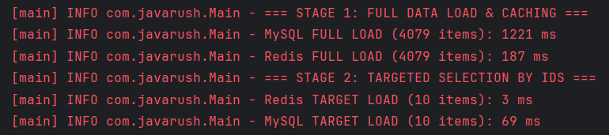
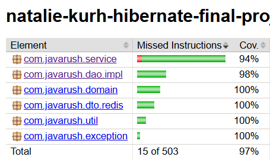

# Hibernate Project
This project demonstrates a high-performance implementation of a three-tier architecture for working with a MySQL
relational database (the 'world' schema) and its optimization using the in-memory NoSQL database Redis as a caching layer.

### 📊 Benchmark results
During final testing, a full extract, transform, and load process was performed for 4,079 cities, along with 
data on their countries and official languages.



| Database / Storage Layer | Operation Type / Technology | Execution Time (ms) |     Efficiency      |
| :--- | :--- |--------------------:|:-------------------:|
| **MySQL** (Hibernate ORM) | Double `JOIN FETCH` (Paging in batches of 500) |            1,221 ms |      Baseline       |
| **Redis** (Lettuce RAM Cache) | `MGET` (Batch deserialization via Jackson) |          **187 ms** | **~6.5x faster 🚀** |

During a point lookup of 10 cities by ID (Stage 2), the Redis response time is 0-3 ms, demonstrating record-breaking 
in-memory performance compared to the 69 ms required for a direct database query.

### 🛠️ Tech Stack

The project is developed in accordance with Clean Code principles, SOLID design principles, business logic encapsulation,
and SonarQube linter requirements.

* **Programming Language:** Java 17 (active usage of `record` classes for immutable DTOs)
* **Build & Dependency Management:** Maven (lifecycle management and third-party dependencies configuration)
* **ORM Framework:** Hibernate Core (Persistence context, session, and transaction management)
* **NoSQL Client:** Lettuce (batch synchronous commands to Redis)
* **Serialization:** Jackson Databind (`ObjectMapper` for transforming DTOs into JSON strings)
* **Code Simplification:** Lombok (annotation-based boilerplate reduction and custom `@ToString.Exclude` filters)
* **Logging:** SLF4J + SLF4J Simple 
* **Containerization:** Docker / Docker Compose (isolated execution of the Redis server)
* **Testing:** JUnit 5 (Jupiter), Mockito (Unit testing), H2 Database (Integration testing)

### 🏢 Project Architecture

1. **Main Layer (`Main.java`):** It manages the resource lifecycle and captures precise, overhead-free execution time metrics.
2. **Service Layer (`CityCountryService`, `CityService`, `CountryService`):** Houses the business logic. It decouples
Jackson, Redis, and mapping operations (`transformDataToDto`) from Hibernate entities. All dependencies 
(such as `RedisCommands`) are injected through the constructor (Dependency Injection).
3. **DAO Layer (`CityDaoImpl`, `CountryDaoImpl`):** Handles HQL/SQL queries exclusively. It is completely isolated from
business rules and domain logic.
4. **Utility Layer (`TransactionManager`):** A custom implementation of a transactional context. It guarantees safe 
`commit()`/`rollback()` operations.

### 🧪 Testing and Code Quality

* **Unit Tests:**
    * `PageTest` – Verifies pagination boundary validation along with exception message verification.
    * `TransactionManagerTest` – Tests transaction commit and rollback behaviors using Mockito mocks.
    * `CityCountryServiceTest` – Performs isolated verification of Jackson serialization and caching methods
  utilizing `mockStatic` for `RedisUtil`. 
    * `CityServiceTest` – Validates pagination business logic (fetching data page-by-page in 500-item steps) and 
  verify edge cases like handling empty databases or point lookups.
    * `CountryServiceTest` – Verifies transaction wrapping for dictionary data extraction and ensures strict 
  error-handling by capturing database failures and wrapping them into a custom `DataProcessingException`.

* **Integration Tests:**
    * `CityDaoImplTest`, `CountryDaoImplTest` – Executed against an in-memory **H2 Database** configured in MySQL 
  compatibility mode (`MODE=MySQL`). The tests automatically generate and clean up the database schema (`create-drop`), 
  validating HQL syntax, pagination, `IN` clause boundary conditions, and `COUNT(*)` aggregations using real city names.

The application code has been successfully analyzed using **SonarQube**, ensuring the absence of critical architectural
errors, bugs, and vulnerabilities. According to **JaCoCo** report, overall code coverage stands at **97%**.



### 🚀 Project Launch

1. **Install:**
    * **Java Development Kit (JDK) 17** or higher.
    * **Apache Maven**.
    
2. **Clone the Repository:**
   Fork and clone this project from the GitHub repository to your local machine.

3. **Run the Application:**
   Open the project in your IDE (e.g., IntelliJ IDEA) 

4. **Start the Redis server:**
   Enter the command in your terminal:
   ```bash
   docker compose up -d
   ```

5. **Execute the Benchmark Application:**
   Run the main benchmark tests directly from your IDE or use the Maven command:
   ```bash
   mvn exec:java -Dexec.mainClass="com.javarush.Main"
   ```